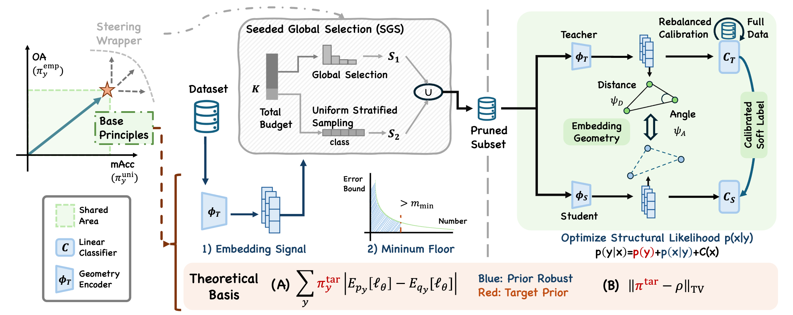
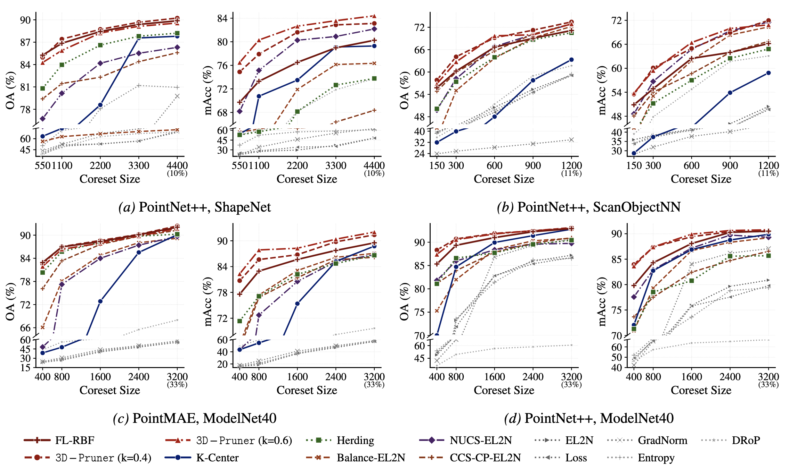

# 3D-Pruner: Dataset Pruning Method for 3D Data

[](LICENSE)
[](https://www.python.org/downloads/release/python-3100/)
[](https://arxiv.org/abs/2603.00651)
[](https://github.com/XiaohanZhao123/3D-Dataset-Pruning/issues)

Official implementation of our paper **[Exploring 3D Dataset Pruning](https://arxiv.org/abs/2603.00651)**.

## Abstract

Dataset pruning has been widely studied for 2D images to remove redundancy and accelerate training, while particular pruning methods for 3D data remain largely unexplored. In this work, we study dataset pruning for 3D data, where its observed common long-tail class distribution nature make optimization under conventional evaluation metrics Overall Accuracy (OA) and Mean Accuracy (mAcc) inherently conflicting, and further make pruning particularly challenging. To address this, we formulate pruning as approximating the full-data expected risk with a weighted subset, which reveals two key errors: coverage error from insufficient representativeness and prior-mismatch bias from inconsistency between subset-induced class weights and target metrics. We propose representation-aware subset selection with per-class retention quotas for long-tail coverage, and prior-invariant teacher supervision using calibrated soft labels and embedding-geometry distillation. The retention quota also serves as a switch to control the OA-mAcc trade-off. Extensive experiments on 3D datasets show that our method can improve both metrics across multiple settings while adapting to different downstream preferences.


> Illustration of our 3D-Pruner framework, which comprises: (1) base principles (utilizing embedding signals, minimum floor selection, and optimizing structural likelihood in post-pruning training) that remain robust and beneficial across different priors, derived from theoretical analysis of the shared region, and (2) a steering warper that balances between the two priors.

## Installation

> **Note:** Full environment setup guide, pre-trained checkpoints, and end-to-end reproduction scripts are **coming soon**. The current release contains the core implementation. Stay tuned for updates.

> This repository is built on top of [PointNeXt](https://github.com/guochengqian/PointNeXt). It depends on [OpenPoints](https://github.com/guochengqian/openpoints) and [Point-MAE](https://github.com/Pang-Yatian/Point-MAE).

```bash
# Create conda environment
conda create -n 3dpruner python=3.10
conda activate 3dpruner

# Install PyTorch (adjust for your CUDA version, see https://pytorch.org)
pip install torch torchvision

# Install dependencies
pip install -r requirements.txt

# Clone required submodules
git clone https://github.com/guochengqian/openpoints.git openpoints/
git clone https://github.com/Pang-Yatian/Point-MAE.git third_party/pointmae/

# Build C++ extensions (requires OpenPoints)
cd openpoints/cpp/pointnet2_batch && python setup.py install && cd ../../..
```

## Dataset Preparation

This project uses standard 3D point cloud datasets. Data will be automatically downloaded by PointNeXt's data loaders on first run, or you can prepare them manually:

- **ModelNet40** (`modelnet40ply2048`): Download from [ModelNet](https://modelnet.cs.princeton.edu/). Place in `data/ModelNet/modelnet40_ply_hdf5_2048/`.
- **ShapeNet55** (`shapenet55`): Download from [ShapeNet](https://shapenet.org/). Place in `data/ShapeNet55/`.
- **ScanObjectNN**: Download from [ScanObjectNN](https://hkust-vgd.github.io/scanobjectnn/). Place in `data/ScanObjectNN/`.

Refer to the [PointNeXt data documentation](https://github.com/guochengqian/PointNeXt#dataset) for more details.

## Quick Start

3D-Pruner runs in three steps.

### Step 1: Train a Base Model

```bash
cd examples/classification
CUDA_VISIBLE_DEVICES=0 python main.py --cfg ../../cfgs/modelnet40ply2048/pointnext-s.yaml
```

### Step 2: Create a Calibrated Teacher

```bash
python class_balanced_retrain.py \
    dataset=modelnet40ply2048 \
    model=pointnext-s
```

Output is saved to `checkpoints/class_balanced/{dataset}/{model}/model_after_retrain.pth`.

### Step 3: Run 3D-Pruner

```bash
python prune_with_incremental_hybrid.py --config-name pruning_balanced \
    pruning.scorer=submodular_rbf \
    pruning.total_samples=400 \
    pruning.hybrid=true \
    pruning.hybrid_per_class_ratio=0.5 \
    pruning.use_rkd=true \
    pruning.use_kd=true
```

## Supported Models

| Model | Config |
|-------|--------|
| PointNeXt-S | `cfgs/modelnet40ply2048/pointnext-s.yaml` |
| Point-MAE | `cfgs_pruning/pruning_balanced_pointmae.yaml` |
| PointNet++ | `cfgs/modelnet40ply2048/pointnet++.yaml` |
| PointMLP | `cfgs/modelnet40ply2048/pointmlp.yaml` |

## Key Configuration Options

```yaml
pruning:
  scorer: submodular_rbf       # FL-RBF for representation-aware selection
  hybrid: true                 # Enable two-phase SGS selection
  hybrid_per_class_ratio: 0.5  # Per-class quota ratio (controls OA/mAcc trade-off)
  total_samples: 400           # Total samples to select
  use_kd: true                 # Prior-invariant teacher supervision (logit KD)
  use_rkd: true                # Embedding-geometry distillation (RKD)
```

## Results


> Comparison of pruning methods across various datasets, models, and budgets on point cloud modality.

## Citation

```bibtex
@article{zhao2026exploring,
  title     = {Exploring 3D Dataset Pruning},
  author    = {Zhao, Xiaohan and Shang, Xinyi and Liu, Jiacheng and Shen, Zhiqiang},
  journal   = {arXiv preprint arXiv:2603.00651},
  year      = {2026}
}
```

## Acknowledgments

We thank the authors of [PointNeXt](https://github.com/guochengqian/PointNeXt), [Point-MAE](https://github.com/Pang-Yatian/Point-MAE), [PointNet++](https://github.com/charlesq34/pointnet2), and [PointMLP](https://github.com/ma-xu/pointMLP-pytorch) for their open-source implementations.
